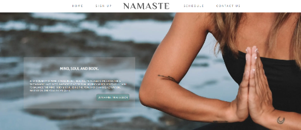
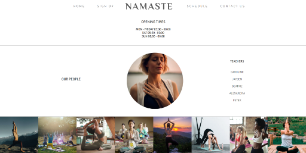
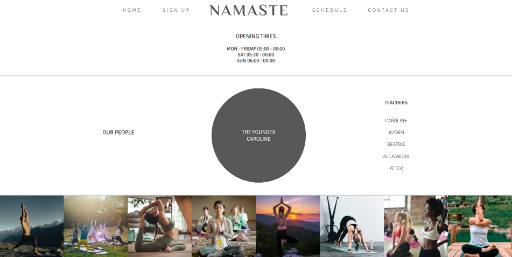
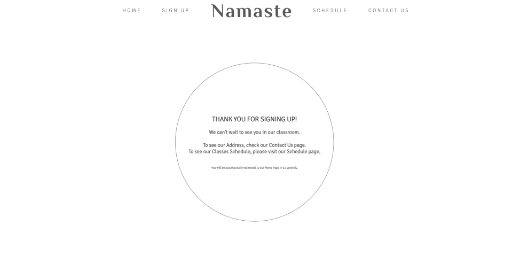

# Project 1 - Namaste

[Namaste](https://brrunaribeiro.github.io/Project-1/)

## Technologies Used

#### Languages Used

    * HTML5
    * CSS3

#### Frameworks, Libraries & Programs Used

            * Hover.CSS
            * Hover.CSS was used on the navigation elements in the header 
            * Git - For version control.
            * Github - To save and store the files for the website.
            * Google Fonts - To import the fonts used on the website.
            * Font Awesome - For the iconography on the website.
            * Google Dev Tools - To troubleshoot and test features, solve issues with responsiveness and styling. 

## User Experience(UX)

##### Strategy

        The website initial ideia is to show an updated schedule, facilitate the Sign-Up process and reach new clients. The company needs more online presence and to grow revenue. The competition has innovative methodology but offers limited classes in limited schedule options. The differencial about Flow is the flexibility in schedule and genuine care for the clients, besides offering more space and even private rooms. Also, the owner temporarely moved to India to learn the best practices and learn from the best. The company focuses on quality and constantly asks for feedback for improvements. 

##### Scope

        Based on the Strategy overview, the website will have a catching-eye home page; an easy to find sign-up page; an online schedule which can be updated and visible to all students at once. In a future realease, a page to possibly leave a feedback/sugestions will be included.

##### Structure

        The home page will have a navigation menu ont he top, with the first link being the Home page link, followed by the sign-up, then the logo, followed by the schedule and contact. 

##### Skeleton

        Navigation bar will the fixed at the top for a visiblliby and to help user to efficiently move through content. Representational icons to help decode which item does. 

#### Surface

        The webiste will have calm colors, with a good contrast for accessibility. A light-weight font and images that bring a sense of peace.  

## Design## Color Reference

| Color             | Hex                                                                |
| ----------------- | ------------------------------------------------------------------ |
| Slate Gray |  #7F8F97 |
| Davy's Gray |  #4E5353 |
| Buff |  #D3997E |
| White |  #FFFFFF |
| Payne's Gray |  #58666C |

## Screenshots

## Deployment

Github Pages was used to deploy the live website. The instructions to achieve this are below:

    * Log in (or sign up) to Github.
    * Find the repository for this project, Bully-Book-Club.
    * Click on the Settings link.
    * Click on the Pages link in the left hand side navigation bar.
    * In the Source section, choose main from the drop down select branch menu. Select Root from the drop down select folder menu.
    * Click Save. Your live Github Pages site is now deployed at the URL shown.

## Tests

    - The W3C Markup Validator and W3C CSS Validator Services were used to validate every page of the project to ensure there were no syntax errors in the project.
        -W3C Markup Validator - Results
        -W3C CSS Validator - Results
    - [WAVE](https://wave.webaim.org) - Web Accessibility Evaluation Tool
        Contrast Ratio: 8.59:1
        WCAG AA: Pass
        WCAG AAA: Pass
        WAVE does not detect contrast of background gradients, transparency, etc. For background images, WCAG requires a fallback background color in case the image does not display.
    - Google Dev Tools - To troubleshoot and test features, solve issues with responsiveness and styling.
   

#### Further Testing

The Website was tested on Google Chrome.
The website was viewed on a variety of devices such as Desktop, Laptop, Mobile Phones and Tablets.
A large amount of testing was done to ensure that all pages were linking correctly.
Friends and family members were asked to review the site and documentation to point out any bugs and/or user experience issues.

## Acknowledgements

    - My Mentor for continuous helpful feedback.

#### Credits

    - Code credits: Bruna Ribeiro
    - Content Credits: MindBodyGreen.com
    - Media Credits: Unsplash.com
    - Icons Credits: FontAwesome.com
    - ReadMe Credits: https://github.com/kera-cudmore & https://github.com/Code-Institute-Solutions/SampleREADME
    - FQA Credits: https://dev.to/felixdusengimana/lets-create-an-faq-section-with-html-and-css-only-detail-tag-explained-12gf

## Features & Explanation of what works

    -Home page with sign-up button to possibly reach new clients.
    -Nav menu with Keyframe(transform) to get user's attention.
    -Form with a date picker for first class/trial lesson.
    -Form confirmation page with time-based automatic redirection to the Home page.
    -Footer with Social media opening in a new tab.
    -Embeded Google Maps Iframe opening in a new tab.
    -Expandable FQA(Frequenty Asked Questions) in Contact page.

### What you did not had time to do

    -Add more content. As the project is fictitious I decided to focus on the features and learning rather than the content. 
    -Invest more time in Readme file.
    -Add more Media Queries.

### Funtionalities you would like to add in the future

    -Date picker starting from today's date and on(You can currently choose dates in the past).
    -

### Bugs you found and solved along the way

    -Google maps Iframe doesnt work. Output Error: "www.google.com refused to connect." - Fixed
    -Navigation links are not working in SignUp page - Fixed
    -Link to CSS sheets had wrong path. Style sheet doesnt load. - Fixed
    -Header/Nav links were not clickable in Contact page at first. -Fixed
    -Contact page has a style issue. -Fixed
    -Link to whatsapp in contact page does not work. -Fixed
    -
